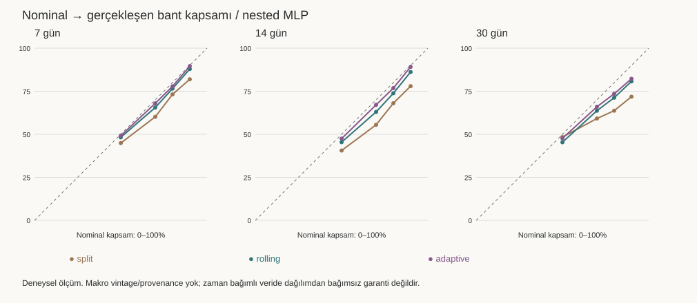

# Ons altın tahmin sistemi — uçtan uca denetim

Rapor: 6 Eylül 2026. Kod düzeltmeleri yereldir; canlı servis ve aktif model değiştirilmedi.

## CURRENT ARCHITECTURE

Önce salt okunur inceleme tamamlandı ve kritik bulgular kullanıcıya açıklandı; uygulama bundan sonra başladı. Bu rapor **üç farklı şeyi ayırır**: canlı artifact'ın eski raporlanan metriği, aynı snapshot'ta eski eğitim reçetesinin yeniden üretimi ve bağımsız kalibrasyonlu yeni deneyler. Bunlar aynı modelin aynı protokolle ölçümü değildir.

```text
xaus günlük OHLC / Yahoo GC=F fallback + FRED son revize seriler
  → parse/normalize → 8 teknik + 11 makro → günlük CSV
  → t+h takvim günü veya sonraki ilk kapanışa simple-return target
  → her vade için expanding walk-forward → scaler → 3 küçük MLP
  → seed ortalaması → calibration weight → beklenen getiri
  → tarihsel hata quantile × volatilite ölçeği → API
  → React grafik/kartlar; ayrıca canlı Harem fiyatı ve kullanıcı senaryoları
```

Kod haritası: `app/services/xau_dataset_service.py` veri/feature/target; `feature_service.py` son vektör; `trainer.py` eğitim/artifact; `model_service.py` yükleme/scaler/ağ/interval; `prediction_service.py` API sözleşmesi; `automatic_learning_service.py` saatlik veri yenileme/eğitim kararı; `learning_service.py` elle eğitim/metrikler; `app/controllers/*` endpoint'ler. Dataset `data/xauusd_training_5y.csv`, artifact joblib + JSON, aktif işaretçi `models/active.json`. Gateway istekleri model servise iletir; market-data servisi ayrı canlı fiyat/tarihçe sağlar. FE akışı `services/api/model.ts → useForecastModel → DashboardContext → ForecastChart/ForecastCards/ScorecardSection`.

Ağ her vade için ayrı: **19 → 8 → 4 → 1**, tanh, 201 parametre/ağ; seed 17/42/91, toplam 603 parametre/vade. L2 alpha=0.08; L1/dropout yok; L-BFGS, max_iter=600 (epoch değil); erken durdurma yok. L-BFGS'de batch-size ve öğrenme hızı ayarları SGD/Adam anlamında kullanılmaz. Küçük veri üzerinde derin ağ eklemek için kanıt yok. Seed ensemble aynı mimarinin üç başlangıcıdır; üç bağımsız bilgi kaynağı değildir.

Eğitim kodu geçmiş fiyatlardan gelecekteki **getiriyi** öğrenir; gelecekteki bütün makro parametreleri bilerek o günün fiyatını çözen nedensel bir fonksiyon değildir. Feature importance veya senaryo oynatmak da nedensellik kanıtı değildir.

Ölçüm snapshot'ı: 1197 satır, 2021-12-01–2026-09-04; SHA256 `c7a87939ea08cac69112b12576015dabd730d57f475fa1d4b1aca67c7cd3e240`. Kod commit `033e9eb88e5dbdabd0f0fb2924a6f739409b9b11`; değişen evaluator dosyasının ayrıca SHA256'ı [manifest](manifest.json) içinde. Aktif yerel servisin yenilediği asıl CSV geri alınmadı; bütün karşılaştırmalar [donmuş kopya](dataset_snapshot.csv) üzerinde yapıldı.

## CRITICAL ISSUES

| Severity | Kanıt / sorun | Yapılan / kalan |
|---|---|---|
| CRITICAL | FRED `observation_date` gerçek yayın tarihi sanılıyor. CPI referans ayı sonradan açıklanır; H.10 günlük geniş dolar verileri sonraki haftalık yayında gelir. | Yayın/vintage zamanlı offline as-of builder ve testler eklendi. **Mevcut 5 yıllık CSV onarılmış PIT veri değildir**; doğrulanmamış kaynakla model terfisi engellenir. |
| CRITICAL | Son revize makro tarihçe geçmişte bilinen değer gibi kullanılıyor. | Kaynak/vintage belirsizliği manifest'te açık; eski seriyi keyfi geciktirmek kesin çözüm diye sunulmadı. |
| HIGH | Yahoo `GC=F` gold futures fallback, spot XAU/USD ile aynı araç gibi yorumlanıyor. Eski CSV kaynak saklamıyor. | Yeni kaynak manifesti futures proxy bilgisini taşır; doğrulanmış spot sayılmaz. Mevcut tarihçenin spot olduğu kanıtlanamaz. |
| HIGH | Eski ağırlık slope'u bütün OOF etiketlerine fit edilip **aynı etiketlerde** başarı raporlanıyor. | Base fit → purged weight-cal → purged interval-cal → dış test ayrıldı. Eski skorlar bağımsız test olarak sunulmuyor. |
| HIGH | Eğitim yalnız standardize, serving ±6σ clip + sabit makroları 0 yapıyor. Aylık CPI normalde sabit kalabilir. | Yeni artifact için ortak scaler/clip; legacy sayısal davranış uyum için korunur. Replay deneyi var. |
| HIGH | Backend hata quantile'ı %80 iken FE %70 bandı etiketi kullanıyor. Volatilite ölçeklemesi sonrası gerçek kapsam bilinmiyor. | Nominal %80 metadata/etiket; ampirik kapsam yoksa doğrulanmış gibi gösterilmez. 50/70/80/90 ölçümleri ayrı üretildi. |
| HIGH | Rolling 5y veri satır sayısı aynı kalınca satır-adedi temelli retrain tetiklenmiyor; eski akış aday modeli otomatik aktifleştiriyor. | Olgunlaşan label tarihleri/hash ile aday eğitim; otomatik promotion kapalı, eski champion korunur. |
| HIGH | Eğitim endpoint'i halka açık ve yetkisiz tetiklenebilir; CPU/disk ve model bütünlüğü riski. | Admin token doğrulaması; güvenli varsayılan. Endpoint canlıda denenmedi/değiştirilmedi. |
| MEDIUM | CPI `t-365` leap-year ay sonunda yanlış referans ayını seçiyor; ilk snapshot'ta 8 örnek. | Exact-month CPI yeni PIT yolunda; legacy ölçüm reçetesi sessizce yeniden yazılmadı. |
| MEDIUM | Tarih/sayı doğrulaması, atomik dosya yazımı, snapshot lineage yetersiz. | Sonlu sayı, pozitif OHLC, sıralı/tekil tarih, target maturity, hash ve atomik replacement testleri. |
| MEDIUM | FE her canlı tick'te sabit beklenen getiriyi yeni fiyata bağlayarak verilmiş tahmini değiştiriyor. | Tahminin baz fiyatı/zamanı ayrı snapshot; client senaryosu resmi performanstan ayrılır. |
| MEDIUM | Gerçek üretim tahmin defteri ve gerçekleşen sonuçlarla bağımsız karne yok. | Opt-in immutable ledger + ayrı outcomes + 30/90 monitoring altyapısı. Gerçek PIT veri ve operasyonel reconciliation olmadan geçmiş production başarısı uydurulmaz. |
| LOW | “DXY”, RSI/ATR tanımı, gün/bar ve skill adı belirsiz. | Gerçek formüller ve birimler audit'te; eski `skill_vs_zero` MSE tabanlıdır, MAE skill ayrı. |

Doğru bilgi koşulu **`information_available_time <= prediction_time`**; istekteki eşitsizlik ters yazılmıştı. Geriye doğru observation as-of fill, ileri tarihli gözlem kullanmasa bile henüz açıklanmamış gözlemi kullanabilir. [Federal Reserve H.10](https://www.federalreserve.gov/Releases/h10/default.htm), [FRED real-time periods](https://fred.stlouisfed.org/docs/api/fred/realtime_period.html), [BLS seasonal adjustment](https://www.bls.gov/cpi/seasonal-adjustment/) bunu destekler. Spot–futures basis farkı getiriye geçince otomatik yok olmaz. [CME açıklaması](https://www.cmegroup.com/articles/case-study/case-study-hedging-risk-with-gold-futures-and-options.html).

İşlem takvimi olmadan tatil/hafta sonu aralığına “eksik işlem günü” demek, aylık CPI değişmedi diye “stale” demek doğru değil. Gerçek yayın tarihi/yaş takibi için kaynak metadata'sı gerekir. Bu sınırlamalar çözülmüş gibi işaretlenmedi.

## CURRENT PERFORMANCE

Canlı servisten **yalnız GET** ile alınan durum; üretim gerçekleşen-tahmin karnesi değil, artifact'ın eski doğrulama metriğidir. Ayrı snapshot/model olduğu için aşağıdaki araştırma tablosuyla doğrudan performans artışı hesaplanamaz.

Kayıt zamanı `2026-09-05T17:02:02.829477+00:00`, model `xauusd-mlp-20260903T201722Z`. [Ham yanıtlar](production_status.json).

| Vade | MAE (getiri yp) | RMSE (yp) | Yön | MSE skill | Ağırlık | OOF n |
|---|---|---|---|---|---|---|
| 7 | 2.433 | 3.157 | — | 0.00% | 0.000 | 537 |
| 14 | 3.161 | 4.162 | 62.06% | 2.14% | 0.138 | 535 |
| 30 | 4.530 | 5.810 | 70.13% | 17.02% | 0.365 | 529 |

Bağımsız yeni protokol: 3 expanding dış blok (başlangıç %55/%70/%85), gerçek hedef olgunlaşma tarihine göre purge, dış blok öncesi 126 satır kalibrasyon; önce ağırlık, daha sonra hedef pencereleri çakışmayan residual kalibrasyon. Standardizasyon/imputation/rejim eşikleri train-only. MLP/ağaç adayları blok başında fit, blok içinde sabit; historical/rolling baseline yalnız o ana kadar olgunlaşmış etiketlerle günlük güncellenir. Bu cadence farkı raporlanır. Random split/KFold yok.

**CSV'nin makro yayın/vintage ve spot kaynak geçmişi doğrulanmadığından, aşağıdaki “OOS” model-fit/kalibrasyon açısından dış örneklemdir; uçtan uca gerçek PIT alpha kanıtı değildir.**

| Yeni nested MLP | n | MAE yp | RMSE yp | Yön | Sıfır dışı görüş oranı | MAE skill | Fiyat MAE ($) | ±2$ isabet |
|---|---|---|---|---|---|---|---|---|
| 7 | 537 | 2.433 | 3.158 | — | 0.00% | 0.00% | 93.29 | 1.86% |
| 14 | 535 | 3.141 | 4.133 | 56.86% | 66.73% | 1.99% | 118.47 | 0.93% |
| 30 | 529 | 4.864 | 6.009 | 77.84% | 33.27% | 4.70% | 181.43 | 0.57% |

Yön yalnız sıfırdan farklı tahminlerde ve sıfır olmayan actual'da ölçülür. 30 günlük %77,84 değer **günlerin sadece yaklaşık üçte birinde** görüş verilmesine aittir; tüm günlerde bu doğruluk iddiası değildir. Araştırma görüş ölçütü sıfırdan farklı getiri, uygulama kullanıcı arayüzü ölçütü weight≥0.2'dir; karıştırılmamalı. Persistence yönü `null`; ±2 yüzde puanı, **±2 dolar değildir**. Getiri MAPE sıfıra yakın hedeflerde anlamsız olduğundan kullanılmadı.

## BASELINE COMPARISON

MAE skill = `1 − MAE_model / MAE_zero_return`; pozitif iyi. Historical majority yön baseline'ına eğitimde bilinen mutlak getirinin medyanı büyüklük olarak eklenmiştir; saf yön başarısı ile fiyat kalibrasyonu ayrı yorumlanır.

| Model | 7d MAE yp / skill | 14d MAE yp / skill | 30d MAE yp / skill |
|---|---|---|---|
| persistence | 2.433 / 0.00% | 3.205 / 0.00% | 5.104 / 0.00% |
| historical_mean | 2.372 / 2.52% | 3.076 / 4.03% | 4.742 / 7.11% |
| rolling_mean_126 | 2.365 / 2.81% | 3.121 / 2.60% | 4.775 / 6.44% |
| momentum_20d | 2.643 / -8.62% | 3.612 / -12.71% | 6.036 / -18.25% |
| direction_majority | 2.378 / 2.28% | 3.066 / 4.34% | 4.528 / 11.29% |
| linear | 2.455 / -0.89% | 3.370 / -5.17% | 5.661 / -10.91% |
| ridge | 2.395 / 1.58% | 3.223 / -0.57% | 5.154 / -0.98% |
| elasticnet | 2.401 / 1.33% | 3.243 / -1.21% | 5.430 / -6.38% |
| random_forest | 2.419 / 0.59% | 3.275 / -2.20% | 5.345 / -4.71% |
| gradient_boosting | 2.377 / 2.29% | 3.191 / 0.42% | 5.248 / -2.81% |
| mlp_raw | 2.368 / 2.69% | 3.178 / 0.84% | 5.216 / -2.18% |
| mlp_nested | 2.433 / 0.00% | 3.141 / 1.99% | 4.864 / 4.70% |
| direction_logistic | 2.356 / 3.17% | 3.136 / 2.16% | 4.620 / 9.50% |
| heterogeneous_calibrated | 2.378 / 2.25% | 3.209 / -0.15% | 4.910 / 3.81% |

Her dış örneklemde always-up yön doğruluğu 7d %61,45, 14d %62,80, 30d %69,19. 14d ham MLP %57,57 ile drift benchmark'ını aşmıyor. Sadece eski kalibre %62,43'e bakıp güçlü parametre öğrenimi demek desteklenmiyor. Son fold'da majority baseline bile 14d negatif skill gösteriyor; bu da rejim istikrarının önemini ortaya koyuyor.

| Aday | Vade | Fold MAE skill (1 / 2 / 3) | Toplam MAE skill %95 block-CI |
|---|---|---|---|
| direction_majority | 7 | 5.10% / 6.36% / -2.07% | -5.62% – 12.02% |
| direction_majority | 14 | 13.61% / 11.91% / -6.95% | -10.26% – 16.93% |
| direction_majority | 30 | 30.74% / 14.47% / -2.12% | -8.33% – 24.16% |
| ridge_macro | 7 | 7.22% / 6.49% / 0.35% | -1.00% – 9.82% |
| ridge_macro | 14 | 10.66% / 9.08% / -4.08% | -7.09% – 11.98% |
| ridge_macro | 30 | 25.30% / 8.33% / -8.13% | -21.41% – 20.51% |
| mlp_nested | 7 | 0.00% / 0.00% / 0.00% | 0.00% – 0.00% |
| mlp_nested | 14 | 0.00% / 6.20% / -0.06% | -2.44% – 5.81% |
| mlp_nested | 30 | 0.00% / 14.66% / 0.00% | 0.17% – 9.99% |
| direction_logistic | 7 | 5.98% / 4.37% / 0.91% | 0.97% – 6.20% |
| direction_logistic | 14 | 5.33% / 4.47% / -1.50% | -1.73% – 6.47% |
| direction_logistic | 30 | 25.62% / 10.48% / -0.40% | -3.34% – 18.33% |

Güven aralıkları bağımlılığı kısmen koruyan 30 gözlemlik moving-block bootstrap (500 tekrar); model ile majority farkında eşleştirilmiş 1000 tekrar var. [Paired sonuçlar](paired_comparisons.json). Bunlar aynı snapshot'a koşullu, çoklu deneme düzeltmesi ve yeni bağımsız seçim holdout'u değildir; 129 sonuçtan en iyiyi seçip garanti verilemez.

## FEATURE AUDIT

19 feature'ın kaynak/formül/lookback/yayın/missing/leakage tablosu [FEATURE_AUDIT.md](../../docs/model-audit/FEATURE_AUDIT.md) içinde. Teknik pencereler çoğunlukla **bar**, makro pencereler **takvim günü**. Dolar sütunu `DTWEXBGS`, ICE DXY değil. Core CPI seasonally-adjusted `CPILFESL`; breakeven doğrudan seri değil DGS10−DFII10 spread'i. ATR için bağımsız yeniden hesaplamaya gerekli ham H/L mevcut CSV'de yok.

| Feature 1 | Feature 2 | Spearman |
|---|---|---|
| gold_return_20d | gold_ma_ratio_50d | 0.866 |
| gold_atr14_pct | gold_volatility_20d | 0.846 |
| gold_ma_ratio_50d | gold_drawdown_60d | 0.810 |
| gold_return_20d | gold_rsi14_centered | 0.776 |
| gold_ma_ratio_50d | gold_rsi14_centered | 0.754 |
| gold_rsi14_centered | gold_drawdown_60d | 0.736 |

Pearson/Spearman tüm snapshot'ta **betimleyici**, feature seçimi için kullanılmadı; MI ilk %50 etiketli bölümde hesaplandı. [Matrisler ve MI](feature_redundancy.json). Her 19 feature için Ridge ve nested MLP'de dış-fold 20-bar blok permutation (3 tekrar) `results.json` içinde. Korelasyonlu özellikleri tek tek bozmak ortak yapıdan uzak senaryolar yaratabilir; önem nedensellik değildir. 7d nested modelin ağırlığı sıfır olduğu için permutation önemleri sıfır; buradan ham özellikler hiçbir bilgi taşımıyor sonucu çıkarılmaz.

| Feature deneyi | 7d skill | 14d skill | 30d skill |
|---|---|---|---|
| mlp_nested | 0.00% | 1.99% | 4.70% |
| mlp_technical | 0.00% | 0.21% | 4.09% |
| mlp_macro | 0.44% | -0.36% | -0.21% |
| mlp_regime | 0.09% | 1.61% | 0.00% |
| mlp_minus_dollar | 1.31% | 1.93% | 0.00% |
| mlp_minus_real_yield | 0.00% | 1.16% | 0.00% |
| mlp_minus_inflation | 1.04% | -0.27% | -3.35% |
| mlp_minus_vix | 0.23% | -0.22% | 0.00% |
| mlp_minus_oil | 0.42% | 2.92% | 0.00% |
| mlp_minus_momentum | 0.98% | -0.75% | 0.15% |
| mlp_minus_volatility | 1.52% | 2.55% | 2.01% |
| mlp_macro_lag_stress | 0.20% | 0.28% | 0.00% |
| mlp_engineered | 0.00% | 1.29% | 0.00% |
| mlp_lookback_10_20_40 | 0.00% | 2.31% | 0.00% |

Ridge macro bazı ortalamalarda iyi olsa da bu **en kritik yayın/vintage sorunu olan grup**. Katkı doğrulanmış sayılamaz. Yeni teknik adaylar SMA20/100/200, EMA/trend slope, z-score, percentile, RSI slope, MACD, momentum acceleration, volatilite oranları ve 10/20/40 pencereleridir. Macro-lag stress CPI45/dolar10/diğer2 takvim günü kaydırma deneyidir; gerçek yayın takviminin yerine geçen bir leakage düzeltmesi değildir. Özellikler sırf teorik makullükle canlı modele eklenmedi.

Macro LEVEL+CHANGE+Z-SCORE, cross-asset ve event-proximity güvenilir ham/PIT seri olmadığı için üretilemedi; mevcut değişimlerden gerçek seviyeler icat edilmedi. SHAP ek bağımlılığı yerine OOF blok permutation kullanıldı.

## REGIME ANALYSIS

Rejim eşikleri yalnız train'de: volatilite 1/3–2/3 quantile; real yield/dolar20 değişim işareti; SMA50 mesafesi ±%2 bull/bear; VIX>20 risk-off. Bunlar tanımlı araştırma grupları, otomatik işlem veya nedensel rejim etiketleri değil. Aşağıda **ham MLP** seçildi; kalibrasyonun sıfır-görüş etkisi gizlenmiyor.

| Rejim | 7d n / skill | 14d n / skill | 30d n / skill |
|---|---|---|---|
| high_vol | 361 / 1.52% | 361 / 1.84% | 355 / -5.38% |
| low_vol | 63 / 3.54% | 60 / -8.36% | 60 / 9.57% |
| rising_real_yield | 252 / 2.19% | 253 / 1.35% | 251 / 4.80% |
| falling_real_yield | 268 / 2.06% | 265 / -0.11% | 261 / -10.22% |
| strong_dollar | 246 / 1.09% | 246 / -1.26% | 249 / 8.30% |
| weak_dollar | 291 / 4.29% | 289 / 3.21% | 280 / -10.83% |
| bull | 332 / 4.33% | 328 / 5.41% | 318 / -1.88% |
| bear | 90 / -0.40% | 90 / -3.07% | 90 / 5.05% |
| risk_off | 124 / 5.58% | 124 / 7.51% | 124 / -5.24% |
| risk_on | 413 / 1.46% | 411 / -2.14% | 405 / -1.37% |

30d ham MLP güçlü dolar grubunda daha iyi, zayıf dolarda belirgin daha kötü; yüksek volatilitede edge yok. Küçük/dependent alt örneklemler ve makro PIT belirsizliği nedeniyle bu gözlemden production regime gate seçilmedi. Regime feature eklemek OOS'ta tutarlı kazanç sağlamadığı için Mixture of Experts'e geçilmedi.

14d için sorun sadece kapasite değil: legacy calibration iyimserliği, target overlap, zayıf yön bilgisi, rejim kararsızlığı ve serving skew birlikte gözleniyor. 10/20/40 lookback, recency, 3y/5y, Ridge/GBR/ensemble denendi; drift baseline'ına karşı sağlam artış kanıtlanmadı. “Daha çok nöron çözer” iddiası desteklenmedi. Ayrı nedensel olarak her hatanın payı bu veriyle ölçülemez.

## UNCERTAINTY CALIBRATION

Aşağıda nested MLP'nin **gerçek dış test kapsamı** var. Aynı testte weight optimize edilmedi. Rolling126 yalnız o tahmin anından önce olgunlaşmış residual'ları tüketir. Adaptive deney, gecikmeli sonuç başına bir kez alpha günceller (gamma .01, alpha .01–.99); özgün ACI'nin koşulsuz garantisini bu uygulamaya taşımıyoruz. [ACI makalesi](https://arxiv.org/abs/2106.00170).

| Vade | Nominal | Split | Vol-normalized | Rolling126 | Adaptive |
|---|---|---|---|---|---|
| 7 | 50.00% | 44.88% | 48.23% | 48.23% | 49.16% |
| 7 | 70.00% | 60.15% | 68.16% | 65.55% | 67.97% |
| 7 | 80.00% | 73.18% | 76.91% | 76.54% | 77.84% |
| 7 | 90.00% | 81.94% | 84.92% | 87.90% | 89.57% |
| 14 | 50.00% | 40.56% | 49.35% | 45.42% | 47.48% |
| 14 | 70.00% | 55.51% | 62.06% | 62.99% | 67.10% |
| 14 | 80.00% | 68.04% | 77.20% | 73.83% | 76.82% |
| 14 | 90.00% | 77.94% | 86.36% | 86.17% | 89.16% |
| 30 | 50.00% | 48.39% | 57.66% | 45.37% | 47.64% |
| 30 | 70.00% | 59.17% | 64.65% | 63.71% | 65.97% |
| 30 | 80.00% | 63.71% | 66.35% | 71.27% | 73.53% |
| 30 | 90.00% | 71.83% | 72.02% | 80.72% | 82.23% |

Adaptive kapsam çoğu seviyede nominale yaklaşıyor; bu tek başına kazanmak değildir: bant genişliği ve interval-score da `results.json` içinde, daha geniş bantla yapay başarı kontrol edilebilir. **Canlı interval algoritması değiştirilmedi**; yanlış nominal etiket ve metadata düzeltildi. Gerçek PIT forward sonuçları olmadan daha iyi kalibre edilmiş production model ilan edilmedi.



## EXPERIMENT RESULTS

43 önceden tanımlı aday × 3 vade = **129 karşılaştırma**, her biri 3 kronolojik dış fold. Tüm sonuçlar, olumsuzlar dahil [EXPERIMENTS.md](EXPERIMENTS.md); parametre/seed/validation tanımları [manifest.json](manifest.json), metrik/fold/rejim/CI/importance/top20 [results.json](results.json), her dış tahmin [oos_predictions.csv](oos_predictions.csv). Convergence warning'ler [ayrı kaydedildi](convergence_warnings.json); sonuçlar sessizce başarılı yakınsama gibi işaretlenmedi.

| Target | n | Mean yp | Median yp | Std yp | Skew | Excess kurtosis | Min yp | Max yp |
|---|---|---|---|---|---|---|---|---|
| 7 | 1192 | 0.401 | 0.422 | 2.539 | -0.196 | 1.986 | -12.032 | 9.723 |
| 14 | 1187 | 0.824 | 0.597 | 3.458 | 0.056 | 1.827 | -15.879 | 15.414 |
| 30 | 1175 | 1.778 | 1.512 | 4.952 | 0.095 | 0.512 | -15.134 | 22.578 |

| Hedef/loss/window deneyi | 7d MAE yp | 14d MAE yp | 30d MAE yp |
|---|---|---|---|
| mlp_nested | 2.433 | 3.141 | 4.864 |
| mlp_log_target | 2.400 | 3.155 | 5.104 |
| mlp_price_target | 2.433 | 3.205 | 5.104 |
| mlp_winsor_train_only | 2.392 | 3.193 | 4.817 |
| boosting_huber | 2.392 | 3.196 | 5.240 |
| boosting_mae | 2.382 | 3.144 | 5.203 |
| mlp_rolling3y | 2.433 | 3.217 | 4.864 |
| mlp_rolling5y | 2.433 | 3.141 | 4.864 |
| mlp_recency_1y | 2.433 | 3.130 | 5.104 |
| mlp_shrinkage_calibration | 2.433 | 3.161 | 5.004 |
| mlp_rolling_calibration | 2.433 | 3.205 | 5.104 |

Log hedef simple return'den tutarlı üstün değil. Raw future price hedefi yalnız train'de standardize edildi fakat calibration sonrası görüş yok; return hedefini korumak bu deneyde daha makul. Winsor train-only %1/%99: 30d ortalama biraz iyileşti, fakat sağlam seçim kanıtı değil. Huber/MAE loss GBR'de test edildi; bunları MLP-loss denemesi olarak sunmuyoruz. Classification-only logistic denendi; fiyat büyüklüğü train medyanıyla ölçekli surrogate, calibrated probability iddiası yok. Heterogeneous ensemble Ridge+GBR+MLP ağırlıkları erken calibration'da nonnegative/sum=1 optimize edildi; dış testte ağırlık seçilmedi.

3y/5y aynı sonuç çıkabildi: toplam geçmiş zaten yaklaşık beş yıl ve train/cal ayrımı nedeniyle bazı fold'larda pencereler aynı örnekleri içeriyor. Bu, başka uzun tarihçelerde pencere etkisizdir demek değildir. Recency yarı ömrü önceden 365 gün seçildi, testte optimize edilmedi.

OOD için train-only Ledoit–Wolf Mahalanobis ve ±6σ; no-view için |getiri|≥0.25σ araştırma maskeleri var. Threshold'lar dış örneklemde kazanan eşik olarak kalibre edilmedi; production'da yeni gate olarak devreye alınmadı. Model skill, büyüklük, belirsizlik, disagreement ayrı kavramlar olarak tutulur.

**Top20 hata analizi:** Her vade için nested/replay/Ridge/ensemble tabloları ayrı artifact'ta. Yakın tarihlerdeki birçok büyük hata aynı örtüşen target hareketini temsil edebilir; 20 bağımsız olay değildir. CPI/FOMC/jeopolitik haber gibi nedenler doğrulanmış geçmiş event takvimi olmadığından etiketlenmedi.

| Vade | Prediction → target | Tahmin yp | Gerçek yp | Mutlak hata $ | VIX | USD20 | Real20 pp |
|---|---|---|---|---|---|---|---|
| 7 | 2026-03-17 → 2026-03-24 | 0.000 | -12.032 | 601.70 | 22.37 | 1.75% | 0.060 |
| 7 | 2026-03-16 → 2026-03-23 | 0.000 | -11.812 | 589.90 | 23.51 | 1.82% | 0.090 |
| 7 | 2026-03-12 → 2026-03-19 | 0.000 | -10.069 | 515.10 | 27.29 | 1.55% | 0.090 |
| 14 | 2026-03-10 → 2026-03-24 | 0.509 | -15.879 | 857.02 | 24.93 | 0.75% | 0.020 |
| 14 | 2025-04-07 → 2025-04-21 | 0.058 | 15.414 | 453.20 | 46.98 | 1.07% | -0.030 |
| 14 | 2026-03-12 → 2026-03-26 | 0.703 | -14.471 | 776.28 | 27.29 | 1.55% | 0.090 |
| 30 | 2025-12-29 → 2026-01-28 | 0.000 | 22.578 | 976.50 | 14.2 | -0.91% | -0.020 |
| 30 | 2025-12-30 → 2026-01-29 | 0.000 | 21.700 | 948.30 | 14.33 | -0.98% | 0.020 |
| 30 | 2025-09-18 → 2025-10-20 | 1.751 | 19.011 | 628.91 | 15.7 | -0.45% | -0.090 |

## BEST MODEL

**Yeni production kazananı yok.** Tutarlı fold/rejim artışı, drift benchmark'ına ek bilgi, doğru kapsam ve doğrulanmış PIT veri şartları birlikte sağlanmadı.

| Vade | Öneri |
|---|---|
| 7d | No-view korunmalı. Basit drift/Ridge macro yalnız araştırma benchmark'ı; PIT doğrulanmadan terfi yok. |
| 14d | Görüş üretmeye zorlama. Yön/MAE drift benchmark'ına karşı bağımsız kanıt bekle; mimari büyütme yok. |
| 30d | Mevcut artifact korunmalı; kazanımı doğrulanmış varsayma. Basit majority/mean ve logistic challenger ile aynı PIT forward testte kıyasla. |

## CHANGES IMPLEMENTED

Phase 1: salt okunur mimari/feature audit tamamlandı. Phase 2: doğruluk bariyerleri ve testleri uygulandı; gerçek PIT kaynak temini **tamamlanmadı**. Phase 3–5: ortak snapshot'ta baselines/features/models deneyleri çalıştırıldı. Phase 6: calibration/coverage araştırması ve dürüst API etiketi; interval replacement yok. Phase 7: yerel ledger/monitoring altyapısı; canlıya devreye alma ve gerçekleşmiş forward karne **tamamlanmadı**.

- Veri: `data_quality.py`, `point_in_time.py`, `xau_dataset_service.py`, `feature_service.py`; canonical 19-vector, finite/OHLC/order kontrolü, atomic CSV+hash manifest, kaynak/vintage açıklığı.
- Eğitim: `preprocessing.py`, `temporal_validation.py`, `trainer.py`, `automatic_learning_service.py`; label-date purge, train/serve clip parity, ayrı calibration, reproducibility ve aday-only eğitim.
- Serving: `model_service.py`, `prediction_service.py`, `prediction_ledger.py`, `api_models.py`, `config.py`, controller/auth, `learning_service.py`; eski artifact sayısal uyumu, status/OOD/interval metadata, immutable kayıt ve ölçüm ayrımı.
- FE: API model/metrics parser, domain types/predict, dashboard model/snapshot context, chart/forecast cards/scorecard; baz-fiyat sabitleme, nominal band bilgisi, no-view satırlarının korunması. Tasarım dili/layout yeniden yapılmadı.
- Deney: `research/evaluation.py`, `scripts/run_model_audit.py`, `summarize_model_audit.py`, `render_model_audit_report.py`, `capture_production_status.py`; testler ve bu rapor.

[Operasyon ve kalan aktivasyon adımları](../../docs/model-audit/OPERATIONS.md). [Doğrulama sonuçları](VERIFICATION.md). Bu yerel değişiklikler commit/push/deploy edilmedi; mevcut CSV'deki çalışan servis kaynaklı fark korundu.

## BEFORE / AFTER

Aynı donmuş dataset, **eski kusurlu global OOF calibration reçetesi** ile yeni nested araştırma protokolü. “After” doğrulama doğruluğudur; aynı kalibrasyon pencere uzunluğu/finalfit politikasını kullanan bir hiperparametre A/B kazancı değildir. Ayrıca bu tablo canlı artifact'ın skorlarıyla karıştırılmamalı. Yeni servis trainer adayının ayrı metadata/sonuçları aday raporundadır.

| Vade | Old → new MAE yp | Old → new yön | New görüş oranı | Old → new MAE skill | Old → new MSE skill |
|---|---|---|---|---|---|
| 7 | 2.382 → 2.433 | 62.38% → — | 0.00% | 2.11% → 0.00% | 2.81% → 0.00% |
| 14 | 3.175 → 3.141 | 62.43% → 56.86% | 66.73% | 0.93% → 1.99% | 1.65% → 3.66% |
| 30 | 4.787 → 4.864 | 70.89% → 77.84% | 33.27% | 6.21% → 4.70% | 10.58% → 11.22% |

Eski 30d skorunun düşmesi üretimde modeli bozduğumuz anlamına gelmez: canlı artifact değiştirilmedi. Bağımsız kalibrasyon, eğitim boyutu ve etkin görüş günleri değiştiği için daha dürüst ölçüm aynı yüksek skoru garanti etmez. 14d araştırma MAE'si küçük iyileşse de baseline/fold/rejim şartlarını karşılamadığı için terfi yapılmadı.

### Gerçek servis trainer'ıyla sıfırdan eğitilen aday

Aday `xauusd-mlp-candidate-20260906T032755333823Z` aynı snapshot'ta gerçek `trainer.train_model` ile max_iter=600 çalıştırılarak üretildi; schema ve champion korunumu doğrulandı. Bu trainer kalibrasyona geçmişin %20'sini ayırır ve weight/residual bölümü %60/%40'tır; araştırmadaki sabit126 ve yarı-yarı bölümlerle aynı deney değildir. **Uygulanan eğitim düzeltmelerinin esas before/after sonucu aşağıdadır.** [Aday artifact ve ayrıntılar](candidate/README.md).

| Vade | Old → candidate MAE yp | Old → candidate MAE skill | Candidate yön | Candidate görüş oranı | Nominal80 gerçek kapsam | Final weight |
|---|---|---|---|---|---|---|
| 7 | 2.382 → 2.401 | 2.11% → 1.34% | 63.13% | 33.33% | 71.88% | 0.0000 |
| 14 | 3.175 → 3.206 | 0.93% → -0.03% | 55.74% | 66.73% | 74.02% | 0.0998 |
| 30 | 4.787 → 4.943 | 6.21% → 3.15% | 63.46% | 66.73% | 70.51% | 0.3285 |

Bu tabloda yön yalnız weight≥0.2 olan sıfır-olmayan görüşlerde; final weight ise bütün mevcut geçmişten gelecek tahmin için kalibre edilen ayrı değerdir. 7/14 final aday no-view; 30 final aday görüş verebilir fakat dış-test kazanımı ve band kapsamı terfi için yeterli değildir. Yeniden eğitim yapıldı; aktif modele entegrasyon kodu hazır, **artifact aktivasyonu yapılmadı**.

## REJECTED IDEAS

- **Bu deneyde terfi reddedildi:** büyük feature seti, raw-price target, heterojen ensemble, log target, Huber/MAE GBR, lookback değişimi ve recency. Bazısı tek ortalamada iyi; ortak istikrar şartlarını sağlamıyor. Ayrıntılar tüm-deney tablosunda.
- **Performansla reddedilmiş değil, çalıştırılmadı:** ortak magnitude+direction multi-head ağı, Bayesian calibration, inverse-error ensemble, SHAP, optimizasyonlu OOD gate. Mevcut doğruluk/veri problemleri çözülmeden ilave karmaşıklığın production değeri kanıtlanamaz; classification-only ve nested constrained ensemble daha basit karşılaştırma olarak çalıştırıldı.
- **Güvenilir veri olmadığı için ertelendi:** macro-level/zscore, silver/copper/S&P/treasury-vol, geçmiş event proximity, gerçek vintage backtest. Bunlar veri yokken sentetik etiket/seri üretmeyerek bırakıldı.
- **İlkesel olarak reddedildi:** random split, test etiketleriyle calibrate edip aynı testi başarı diye sunmak, güncel revize seriye “PIT” demek, %70 etiketiyle %80 quantile göstermek, 30d'yi toplam skor adına değiştirmek, yeni adayı otomatik canlıya geçirmek, ±2$ garanti etmek.

## FINAL RECOMMENDATION

Öncelik yeni ağ değil, **doğrulanmış spot + yayın/vintage verisi ve bağımsız forward ölçüm**. Yalnız veri çoğaltmak veya nöron eklemek bu eksikliği gidermez.

1. Tek bir spot XAU/USD kapanış sağlayıcısı/session seç; ham OHLC, source, instrument, completed_at ve değişmeyen snapshot hash'lerini arşivle. Futures proxy'yi spot başarı karnesine katma.
2. Makro gözlem tarihi yanında gerçek available_at/vintage sakla; CPI önceki yıl aynı referans ayı. FRED/ALFRED geçmiş release/vintage erişimi ve provider lisansı gerektiğinde temin edilmeli. [FRED vintage dates](https://fred.stlouisfed.org/docs/api/fred/series_vintagedates.html). Yeni builder'dan gerçek PIT dataset'i yeniden üret.
3. Bu rapordaki aynı chronological deneyleri PIT snapshot'ta tekrar çalıştır; seçimde görülmemiş yeni dönem üzerinde teyit et. Horizon bazında baseline skill + direction + fold/rejim tutarlılığı + coverage/width koşullarını birlikte değerlendir.
4. Mevcut 30d artifact'ı koru; 7/14d no-view yeteneğini koru. Tahminleri tek baz-fiyat/timestamp ile immutable kaydet; doğrulanmış aynı kaynak kapanışlarıyla target sonrası uzlaştır; 30/90 gerçek forward karne dolmadan başarı ilan etme.
5. Düzeltmeleri test/staging sonrası ayrı bir deployment adımıyla al. Model terfisi ayrı, açık operatör kararı olmalı; bu çalışma hiçbir adayı canlıya almadı.

Sonuç: mevcut veriyle parametrelerin yeni piyasa koşullarında güvenilir fiyat ürettiğini veya ±2$ hassasiyeti sağladığını kanıtlayamıyoruz. Buna karşın veri ve ölçüm hataları somutlaştırıldı, yanlış güven üreten yollar için bariyerler kondu ve tekrar üretilebilir karşılaştırma altyapısı çalıştırıldı.
